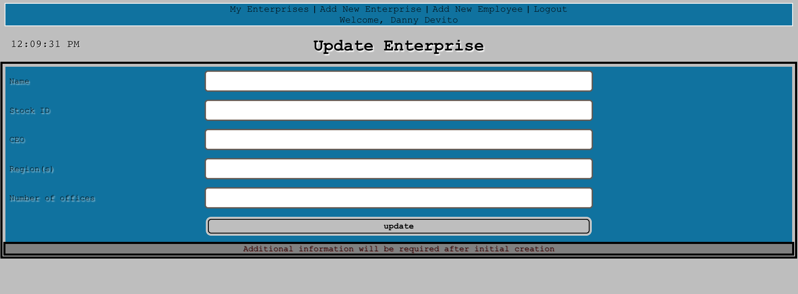
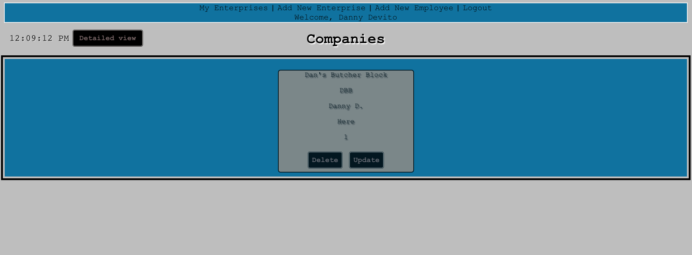

## FateBook ##

This was my first MERN application and our final project at General Assembly. This app was originally designed to store the records of real companies, the real employees within those companies, and the records of those employees. So far it is a full CRUD application lacking the proper implementation of the employees and their records. In the future I plan to: 

- Have editable and individual records linked to employees by ID. 
- Have the remaining CRUD functions applied to employees. 
- Have two user view options (ceo/manager and employee).
- Have users only be able to view their created and relevant records.
- Create a search function with filters (records, employees, and companies).
- Implement seed data (region/country dropdown).
- Make app universally adaptive 
- Implement image uploading.
- Clean up navigation and redirection.
- Clean up UI and make more presentable.

Check out the trello board:
https://trello.com/b/8B11cFwE/fatebook

Check out the site:
https://project-004.herokuapp.com/

## Technologies Used ##
1. MongoDB
2. GitHub
3. Javascript
4. React
5. HTML/CSS
6. Trello
7. Heroku
8. LucidChart

The site so far:

